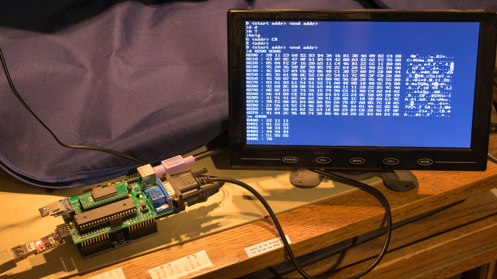
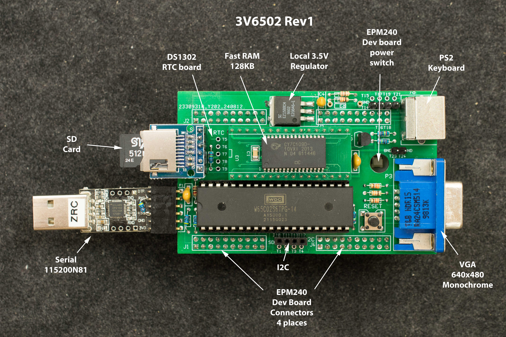

# 3V6502 Rev1 Mezzanine Board for EPM240 Dev Board
### Introduction
W65C02 can be overclocked to 25MHz at 3.5V, so this 3V6502 mezzanine board is designed with local voltage regulator that is trimmed to 3.5V so to support W65C02 operation at 25MHz. At 25MHz 6502 software can drive a VGA display directly which is traditionaly known as “beam racing”. 6502 also can also bit-bang the PS2 keyboard thus becomes a standalone computer with its own VGA display and keyboard.

### Features
- W65C02 overclocked to 25MHz
- 128K RAM
- 512 byte flash embedded in EPM240 boot program stored in SD card
- ACIA emulation in EPM240
- SD card interface
- RTC module based on DS1302
- I2C interface
- Local 3.3V regulator adjusted to 3.5V

### Theory of Operation
Place holder for now

### Design Files
- Schematic

- Gerber photoplots

- CPLD design files

  - PDF schematic of top-level CPLD design
- Memory Map

- Bill of Materials

- Engineering change to EPM240 Development board. A short jumper is required from J4-pin1 to clock3.

### Software
- Bootstrap software in CPLD internal flash. This software initialize the SD card and load program stored in designated sectors in the SD card into RAM and execute.

- 3V6502 monitor interface to terminal emulator at 115200N81

- SD image contains rev0.2 of 3V6502 monitor. With this SD image, 3V6502 will auto boot into rev 0.2 monitor

- 3V6502 standalone computer monitor. This is a simple monitor that receives inputs from PS2 keyboard and drives VGA display.

- 
